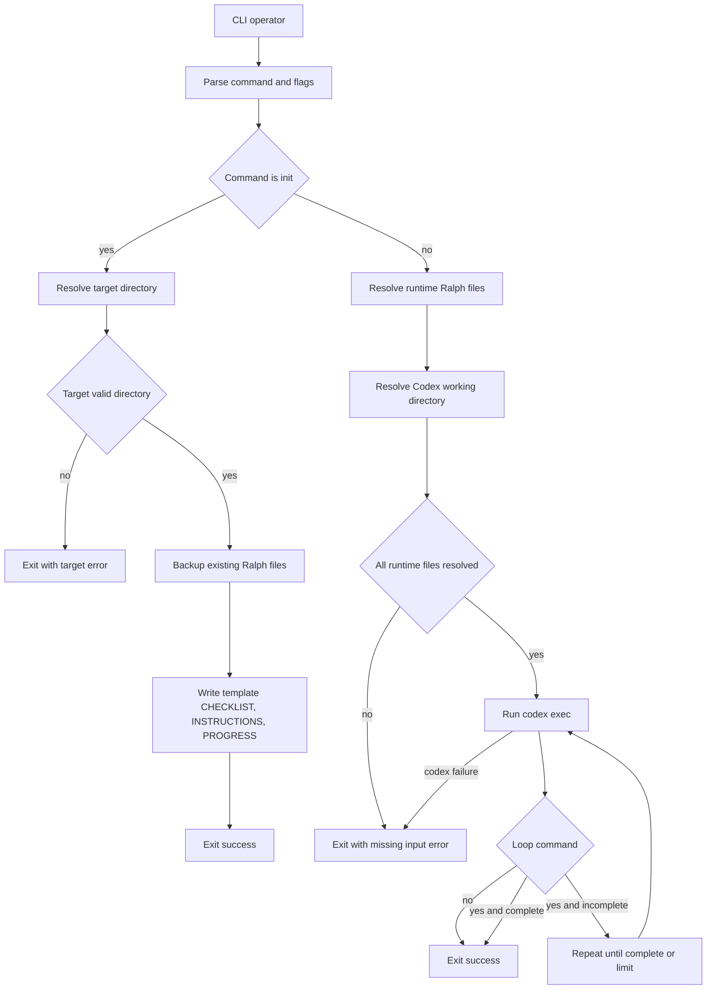
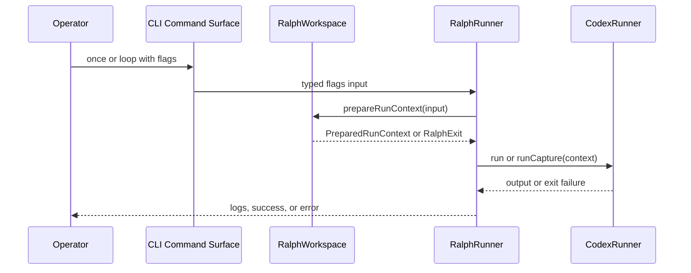

# Approval View

## Executive Summary

- This pack now provides one coherent authored baseline for Ralph's new `init` command, shared runtime file resolution through `--ralph-dir`, separate Codex execution-directory control through `--cwd`, and fail-closed runtime input handling.
- Across the four canonical artifacts, bundled Ralph repo files are consistently scoped as init-only template assets and are explicitly removed as implicit runtime defaults for `ralph once` and `ralph loop`.
- The pack is implementation-ready at the specification level: operator-visible behavior, verifiable requirements, and an Effect-aligned service decomposition are now aligned.

### Visual Evidence

- Source: /Users/urbanfaubion/.supacode/repos/ralph/ralph-effect/.specs/ralph-init-and-project-directory/technical-design.md :: Process Flowchart

- Source: /Users/urbanfaubion/.supacode/repos/ralph/ralph-effect/.specs/ralph-init-and-project-directory/technical-design.md :: Interaction Diagram

## Scope

- In scope:
  - Approved charter scope for `ralph init`, `--ralph-dir`, `--cwd`, template-only bundled assets, backup-before-overwrite, and hard-error missing-input behavior.
  - User-visible behavior for init flows, explicit file-only runs, override precedence, fail-fast missing inputs, and separate Codex execution-directory control.
  - Stable product obligations and technical boundaries for implementing the feature set.
- Out of scope:
  - Execution planning, task sequencing, or commit breakdown.
  - Code changes themselves.
  - Any return to bundled runtime defaults or implicit current-directory discovery.

## Decisions Required for Approval

- Approve this full spec pack as the implementation baseline for the Ralph CLI changes in this scope.
- Approve the pack-wide contract that runtime Ralph inputs must come from `--ralph-dir` or explicit file flags and must never come from implicit bundled defaults.
- Approve the technical-design boundary that introduces `RalphWorkspace` as the owning seam for template writes, runtime input resolution, and backup-before-overwrite logic.

## Risks and Tradeoffs

- This pack formalizes a breaking change for operators who previously relied on no-input bundled defaults.
- The pack intentionally leaves backup naming as a design assumption rather than a product requirement, so implementation must preserve prior contents without undermining operator clarity.
- The pack preserves two nearby directory concepts, `--ralph-dir` and `--cwd`, so implementation and help text must keep those concepts sharply separated.

## Blockers and Unresolved Items

- None

## Traceability Map

- [T1] Claim: The approved pack limits bundled Ralph repo files to init-only template use.
  - Source: /Users/urbanfaubion/.supacode/repos/ralph/ralph-effect/.specs/ralph-init-and-project-directory/charter.md :: Goals
  - Evidence quote: "- Limit the bundled Ralph repo copies of `CHECKLIST.md`, `INSTRUCTIONS.md`, and `PROGRESS.md` to template use in `ralph init`, not implicit runtime input use in `ralph once` or `ralph loop`."
- [T2] Claim: The approved pack makes missing runtime Ralph inputs a hard failure instead of allowing implicit fallback behavior.
  - Source: /Users/urbanfaubion/.supacode/repos/ralph/ralph-effect/.specs/ralph-init-and-project-directory/requirements.md :: Functional Requirements
  - Evidence quote: "- FR1.7: After applying `--ralph-dir` and any explicit per-file overrides, `ralph once` and `ralph loop` shall fail with a clear error whenever any required runtime file remains unresolved or does not exist as a regular file; they shall not fall back to bundled repo files or implicit current-directory discovery."
- [T3] Claim: The approved pack preserves fully explicit runtime file input runs without requiring `--ralph-dir`.
  - Source: /Users/urbanfaubion/.supacode/repos/ralph/ralph-effect/.specs/ralph-init-and-project-directory/user-stories.md :: Story: Run with explicit file flags and no shared Ralph directory
  - Evidence quote: "- Observation: The run uses the explicitly supplied file paths and starts without requiring `--ralph-dir`."
- [T4] Claim: The approved pack preserves separate Codex execution-directory control through `--cwd`.
  - Source: /Users/urbanfaubion/.supacode/repos/ralph/ralph-effect/.specs/ralph-init-and-project-directory/requirements.md :: Technical Constraints
  - Evidence quote: "- TC3.3: `--ralph-dir` shall affect only Ralph runtime file lookup, while `--cwd` shall affect only Codex's working directory."
- [T5] Claim: The approved pack defines an implementable Effect-aligned service boundary for these changes.
  - Source: /Users/urbanfaubion/.supacode/repos/ralph/ralph-effect/.specs/ralph-init-and-project-directory/technical-design.md :: Components and Responsibilities
  - Evidence quote: "- Owned capability: resolve and validate Ralph file paths, create target directories, reject file targets, back up overwritten files, and write template files"

## Validator Status

- Canonical validator:
  - Command: bash .agents/skills/write-charter/scripts/validate_charter.sh .specs/ralph-init-and-project-directory/charter.md && bash .agents/skills/write-user-stories/scripts/validate_user_stories.sh .specs/ralph-init-and-project-directory/user-stories.md && bash .agents/skills/write-requirements/scripts/validate_requirements.sh .specs/ralph-init-and-project-directory/requirements.md && bash .agents/skills/write-technical-design/scripts/validate_technical_design.sh .specs/ralph-init-and-project-directory/technical-design.md
  - Result: Passed
- Approval-view validator:
  - Command: bash .agents/skills/write-approval-view/scripts/validate_approval_view.sh pack .specs/ralph-init-and-project-directory/approval/pack.md .specs/ralph-init-and-project-directory/approval/pack.html /Users/urbanfaubion/.supacode/repos/ralph/ralph-effect/.specs/ralph-init-and-project-directory/charter.md /Users/urbanfaubion/.supacode/repos/ralph/ralph-effect/.specs/ralph-init-and-project-directory/user-stories.md /Users/urbanfaubion/.supacode/repos/ralph/ralph-effect/.specs/ralph-init-and-project-directory/requirements.md /Users/urbanfaubion/.supacode/repos/ralph/ralph-effect/.specs/ralph-init-and-project-directory/technical-design.md
  - Result: Passed

## Downstream Impact if Approved

- Implementation can treat the charter, user stories, requirements, and technical design as a stable specification baseline.
- Execution planning or direct coding can proceed without re-opening runtime input fallback semantics, override precedence, or main service boundaries.
- Test planning can target init path handling, overwrite safety, fail-fast run validation, and `--cwd` separation with full cross-artifact traceability.

## Snapshot Identity

- Review type: Pack
- Approval mode: Initial
- Spec-pack root: /Users/urbanfaubion/.supacode/repos/ralph/ralph-effect/.specs/ralph-init-and-project-directory
- Pack snapshot SHA-256: 8823a488cd9c2d65c8884926a55b4275de9b41255fa3282283ac8c1e5010b660
- Approval view generated_at: 2026-04-16T12:56:09Z
- Included snapshots:
  - /Users/urbanfaubion/.supacode/repos/ralph/ralph-effect/.specs/ralph-init-and-project-directory/charter.md | SHA-256: f3e35a8e2c6f9b28a19b75a28a1d9a7b0b40f50ee569b58620560af47376ff8e | updated_at: 2026-04-15T22:54:24Z
  - /Users/urbanfaubion/.supacode/repos/ralph/ralph-effect/.specs/ralph-init-and-project-directory/requirements.md | SHA-256: 465dcb7d544b6426504958cd795c3f4c0e167540727f8fe161156f078ddb1a89 | updated_at: 2026-04-15T23:22:01Z
  - /Users/urbanfaubion/.supacode/repos/ralph/ralph-effect/.specs/ralph-init-and-project-directory/technical-design.md | SHA-256: ce23d4cb4e08d3db390019f53d5c32af55742efe0aebae60d8394d8a42fa918b | updated_at: 2026-04-15T23:22:01Z
  - /Users/urbanfaubion/.supacode/repos/ralph/ralph-effect/.specs/ralph-init-and-project-directory/user-stories.md | SHA-256: 68ee4e9616e30f3f40c572765f14d3a4ef6ffea846d49466e53d8df9ef2ac93c | updated_at: 2026-04-15T22:58:48Z
