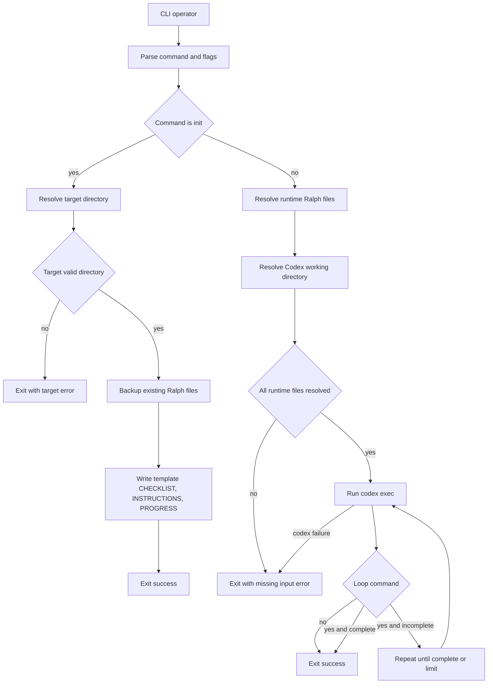
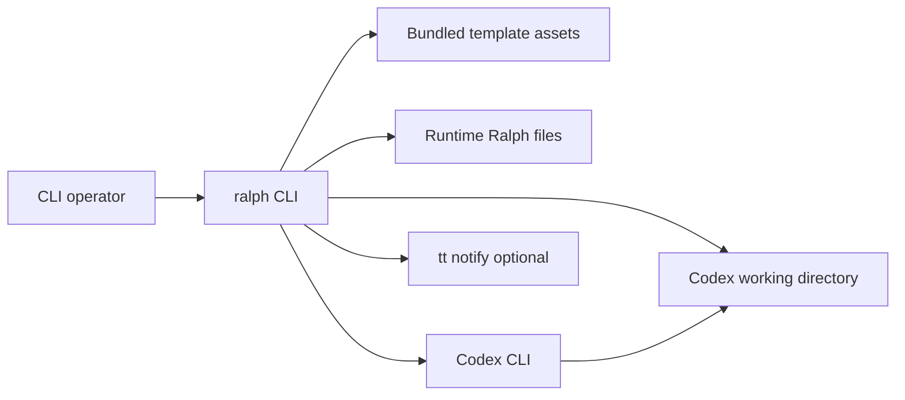
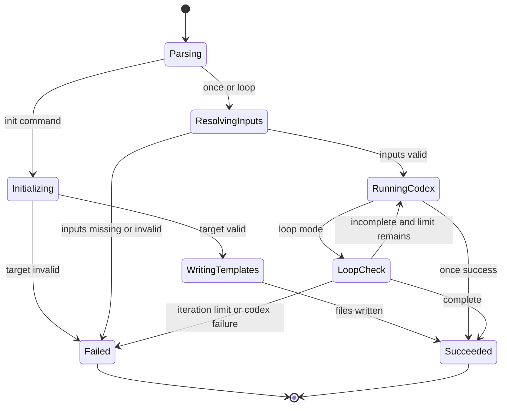
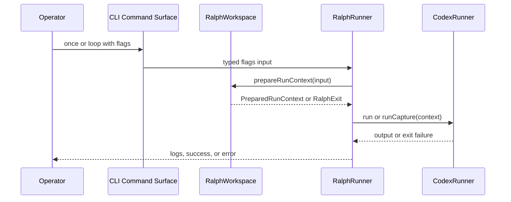

# Approval View

## Architecture and Runtime Model

- The design keeps `src/index.ts` as the Bun and Effect composition root and introduces `RalphWorkspace` as the new bounded service for template and runtime-file policy.
- Runtime behavior stays CLI-only and process-oriented: commands either materialize Ralph files or resolve validated inputs and invoke `codex exec`.
- The design's main architectural boundary is fail-closed runtime input resolution, so bundled Ralph files remain init-only template assets instead of runtime fallbacks.

### Visual Evidence

- Source: /Users/urbanfaubion/.supacode/repos/ralph/ralph-effect/.specs/ralph-init-and-project-directory/technical-design.md :: Process Flowchart

- Source: /Users/urbanfaubion/.supacode/repos/ralph/ralph-effect/.specs/ralph-init-and-project-directory/technical-design.md :: Context Flowchart

- Source: /Users/urbanfaubion/.supacode/repos/ralph/ralph-effect/.specs/ralph-init-and-project-directory/technical-design.md :: Behavior State Diagram

- Source: /Users/urbanfaubion/.supacode/repos/ralph/ralph-effect/.specs/ralph-init-and-project-directory/technical-design.md :: Entity Relationship Diagram
- Not needed: Ralph manipulates a fixed trio of filesystem artifacts and transient backup files, but the design does not depend on durable relational entities or evidence-backed cardinalities.

- Source: /Users/urbanfaubion/.supacode/repos/ralph/ralph-effect/.specs/ralph-init-and-project-directory/technical-design.md :: Interaction Diagram

## Boundaries, Interfaces, and Data Flow

- Boundary 01: Approve `RalphWorkspace` as the service seam that owns template asset lookup, init filesystem mutations, runtime file resolution, and precedence rules between `--ralph-dir` and explicit per-file flags.
- Boundary 02: Approve `RalphRunner` as orchestration only, not the owner of template or path-resolution policy.
- Boundary 03: Approve `CodexRunner` as the process contract that receives only a validated `PreparedRunContext` and translates it into `codex exec` arguments.
- Boundary 04: Approve the accepted input grammar split where `--ralph-dir` affects only Ralph file lookup and `--cwd` affects only Codex's working directory.

## Implementation Strategy and Operational Seams

- Seam 01: Keep `src/index.ts` as the single runtime recomposition site and add `RalphWorkspace.layer` beside `CodexRunner.layer` and `HostTools.layer`.
- Seam 02: Extend the typed CLI payloads in `src/cli/app.ts` and `src/ralph/domain.ts` to include the init operand, `ralphDir`, and `cwd` without inventing a second run-input shape.
- Seam 03: Move the current bundled-file resolution helpers out of `RalphRunner` so bundled assets are consumed only by init workflows, not by runtime run preparation.
- Seam 04: Keep direct runtime escape hatches explicit: module-relative template lookup, child-process spawning, host command probing, and optional desktop notifications remain isolated edge behavior.

## Major Risks and Tradeoffs

- Risk 01: Extracting `RalphWorkspace` adds one more internal service boundary, but it prevents filesystem policy and loop orchestration from hardening together in `RalphRunner`.
- Risk 02: Template asset lookup through packaged files is simple, but a packaging mistake would break `ralph init` even if run logic remains correct.
- Risk 03: Timestamped backup files preserve previous contents cleanly, but weak naming or weak success messaging could make repeated reinit flows harder for operators to inspect.

## Decisions Required for Approval

- Decision 01: Approve `RalphWorkspace` as the primary implementation seam for template writes, backup-before-overwrite, and fail-closed runtime input resolution.
- Decision 02: Approve keeping `CodexRunner` process-focused and moving new path-resolution policy out of both `RalphRunner` and the CLI command layer.
- Decision 03: Approve the timestamped sibling-file backup strategy assumption for overwritten Ralph files.

## Open Questions and TODO: Confirm Items

- None

## Traceability Map

- [T1] Claim: The design introduces `RalphWorkspace` as the boundary that owns template writes and runtime input resolution.
  - Source: /Users/urbanfaubion/.supacode/repos/ralph/ralph-effect/.specs/ralph-init-and-project-directory/technical-design.md :: Components and Responsibilities
  - Evidence quote: "- Owned capability: resolve and validate Ralph file paths, create target directories, reject file targets, back up overwritten files, and write template files"
- [T2] Claim: The design keeps `--ralph-dir` and `--cwd` as separate concerns.
  - Source: /Users/urbanfaubion/.supacode/repos/ralph/ralph-effect/.specs/ralph-init-and-project-directory/technical-design.md :: Interfaces and Contracts
  - Evidence quote: "- Trigger and boundary conditions: init mutates filesystem state only after target validation; once and loop start Codex only after all runtime inputs resolve; `--cwd` changes only Codex's working directory and must not alter Ralph file lookup."
- [T3] Claim: The design makes fail-closed runtime input resolution a primary security and reliability boundary.
  - Source: /Users/urbanfaubion/.supacode/repos/ralph/ralph-effect/.specs/ralph-init-and-project-directory/technical-design.md :: Security, Reliability, and Performance
  - Evidence quote: "- The main security boundary is fail-closed input resolution: Ralph must not cross project boundaries by silently reading bundled repo files or discovered local files when runtime inputs are missing."
- [T4] Claim: The composition root remains `src/index.ts`, with `RalphWorkspace.layer` added beside the existing runner dependencies.
  - Source: /Users/urbanfaubion/.supacode/repos/ralph/ralph-effect/.specs/ralph-init-and-project-directory/technical-design.md :: Implementation Strategy
  - Evidence quote: "- Recomposition sites: keep `src/index.ts` as the single runtime composition root; keep `src/cli/app.ts` as the CLI grammar assembly point; extend `RalphRunner.layer` to provide a new `RalphWorkspace.layer` alongside `CodexRunner.layer` and `HostTools.layer`."
- [T5] Claim: The design preserves `CodexRunner` as the process-execution boundary.
  - Source: /Users/urbanfaubion/.supacode/repos/ralph/ralph-effect/.specs/ralph-init-and-project-directory/technical-design.md :: Components and Responsibilities
  - Evidence quote: "- Owned capability: render the Codex prompt from resolved files, select yolo versus sandbox arguments, run or capture child-process output, and interpret checklist completion markers"

## Validator Status

- Canonical validator:
  - Command: bash .agents/skills/write-technical-design/scripts/validate_technical_design.sh .specs/ralph-init-and-project-directory/technical-design.md
  - Result: Passed
- Approval-view validator:
  - Command: bash .agents/skills/write-approval-view/scripts/validate_approval_view.sh artifact /Users/urbanfaubion/.supacode/repos/ralph/ralph-effect/.specs/ralph-init-and-project-directory/technical-design.md .specs/ralph-init-and-project-directory/approval/technical-design.md .specs/ralph-init-and-project-directory/approval/technical-design.html
  - Result: Passed

## Downstream Impact if Approved

- Impact 01: Implementation can add `init`, `--ralph-dir`, and `--cwd` without reopening ownership boundaries.
- Impact 02: Coding can extract path-resolution logic from `RalphRunner` into `RalphWorkspace` and keep `CodexRunner` focused on process execution.
- Impact 03: Test planning can target the new workspace seam, override precedence, init backup behavior, and `--cwd` separation with clear architectural anchors.

## Snapshot Identity

- Review type: Artifact
- Approval mode: Initial
- Canonical artifact: /Users/urbanfaubion/.supacode/repos/ralph/ralph-effect/.specs/ralph-init-and-project-directory/technical-design.md
- Snapshot SHA-256: ce23d4cb4e08d3db390019f53d5c32af55742efe0aebae60d8394d8a42fa918b
- Canonical updated_at: 2026-04-15T23:22:01Z
- Approval view generated_at: 2026-04-16T00:21:29Z
