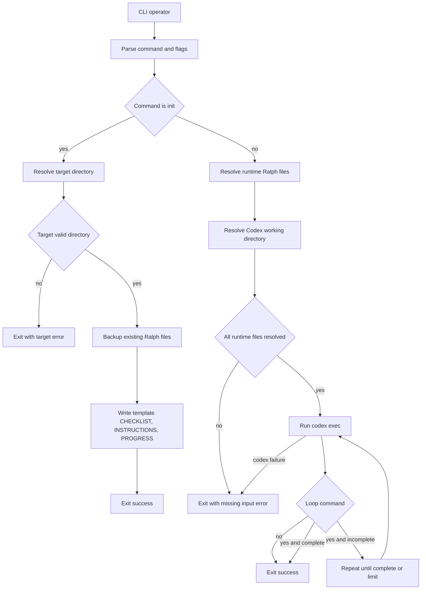
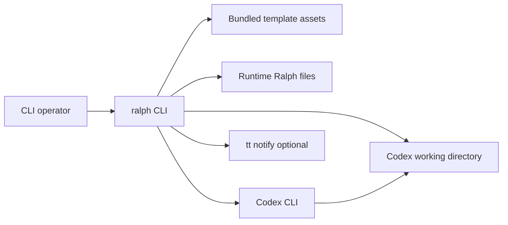
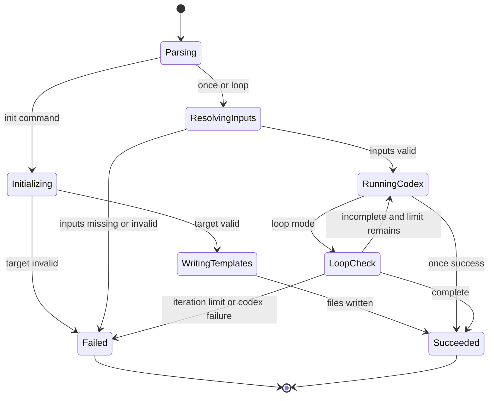
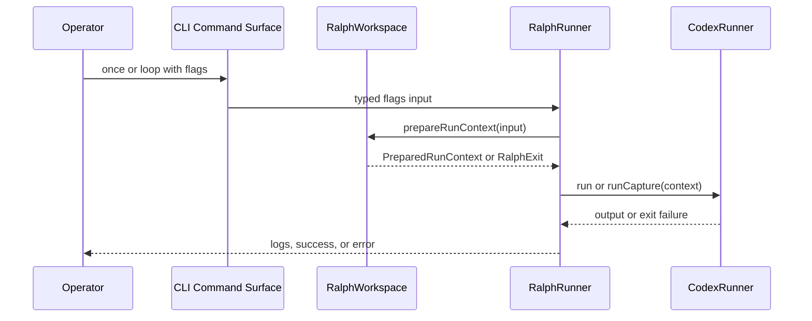

## Architecture Summary

- Runtime profile: CLI-only Bun application using Effect command parsing, layers, filesystem services, and child-process execution.
- Composition root: `src/index.ts`, where `Command.run(ralphCommand, ...)` is provided with `RalphRunner.layer` and Bun services.
- Main execution model: Parse CLI input once, branch into `init`, `once`, or `loop`, resolve explicit filesystem-backed inputs, then either write template files or run `codex exec` with a prepared context.
- Summary: The design keeps the current thin CLI edge and Effect service style, but splits durable ownership more clearly: the command surface owns grammar, a workspace service owns template and runtime-file resolution, `RalphRunner` owns run orchestration, and `CodexRunner` owns process execution. The main design consequence of the approved scope is a fail-closed runtime-input boundary: bundled Ralph files are template assets for `init` only, while `once` and `loop` must receive all runtime inputs through `--ralph-dir` or explicit file flags.

## System Context

- Ralph is a local operator-facing CLI that sits between the operator, the local filesystem, and the Codex CLI. It reads or writes Ralph files in operator-selected directories, then invokes `codex exec` against a chosen project working directory.
- Story or requirements traceability: US1.1, US1.4, US1.8, US1.9; FR1.1, FR1.3, FR1.7, FR1.8, TC3.3, TC3.4

### Process Flowchart



### Context Flowchart



## Components and Responsibilities

### Behavior State Diagram



### CLI Command Surface

The command surface owns CLI grammar and converts operator input into typed command payloads without embedding durable filesystem or process policy.

- Boundary type: command handler
- Owned capability: define `init`, `once`, and `loop` command signatures plus shared flag grammar
- Hidden depth: alias mapping, optional operand parsing, and the shared meaning of `--ralph-dir`, per-file flags, and `--cwd`
- Inputs: raw argv, command help metadata, operator-selected flags and operand values
- Outputs: typed `SharedFlagsInput`, `LoopFlagsInput`, and init payloads passed into services
- Story impact: US1.1, US1.2, US1.5, US1.6, US1.7, US1.8, US1.9; FR1.1, FR1.4, FR1.5, FR1.6, FR1.8, TC3.1

### RalphWorkspace

`RalphWorkspace` owns template asset lookup, init filesystem mutations, runtime Ralph file resolution, and the fail-closed validation contract for run inputs.

- Boundary type: service
- Owned capability: resolve and validate Ralph file paths, create target directories, reject file targets, back up overwritten files, and write template files
- Hidden depth: precedence rules between `--ralph-dir` and explicit per-file flags, launch-directory-relative path resolution, template asset resolution through module paths, and backup-on-overwrite policy
- Inputs: init operand, shared run flags, Effect `FileSystem`, Effect `Path`, launch directory, bundled template asset paths
- Outputs: written template files for `init` and a validated `PreparedRunContext` for `once` and `loop`
- Story impact: US1.1, US1.2, US1.3, US1.4, US1.5, US1.6, US1.7, US1.8; FR1.1, FR1.2, FR1.3, FR1.4, FR1.5, FR1.6, FR1.7, TC3.2, TC3.4, IR5.1

### RalphRunner

`RalphRunner` owns high-level run orchestration and delegates filesystem resolution and process execution to narrower services.

- Boundary type: service
- Owned capability: sequence command availability checks, prepared-context creation, one-shot execution, loop iteration control, completion checks, and optional notifications
- Hidden depth: loop termination policy, message logging, and edge-level error propagation through `RalphExit`
- Inputs: typed command payloads, `RalphWorkspace`, `CodexRunner`, `HostTools`
- Outputs: completed init or run command effects with operator-visible success or failure
- Story impact: US1.4, US1.5, US1.6, US1.8, US1.9; FR1.3, FR1.4, FR1.5, FR1.7, FR1.8, NFR2.2, NFR2.3

### CodexRunner

`CodexRunner` owns the `codex exec` process contract and turns a prepared run context into an actual child-process invocation.

- Boundary type: service
- Owned capability: render the Codex prompt from resolved files, select yolo versus sandbox arguments, run or capture child-process output, and interpret checklist completion markers
- Hidden depth: child-process spawning, exit-code translation, stdout capture, and the exact `codex exec -C` argument layout
- Inputs: validated `PreparedRunContext`, `ChildProcessSpawner`
- Outputs: process execution side effects, captured output for loop mode, and success or failure exit handling
- Story impact: US1.5, US1.6, US1.7, US1.8, US1.9; FR1.5, FR1.6, FR1.7, FR1.8, IR5.2

### HostTools

`HostTools` owns host capability probing and optional notification integration that sits outside the core Ralph file-resolution rules.

- Boundary type: service
- Owned capability: verify required commands exist and send best-effort desktop notifications when available
- Hidden depth: `which` probing, optional `tt notify` invocation, and recovery from notification failures
- Inputs: command names, notification messages, `ChildProcessSpawner`
- Outputs: availability booleans, command-precondition failures, optional notifications
- Story impact: FR1.7, FR1.8, DEP6.1

## Data Model and Data Flow

- Entities: typed command inputs, the three canonical Ralph runtime files, bundled template assets, per-file backup artifacts, and `PreparedRunContext` as the final run contract.
- Flow: CLI parsing produces typed flags and operand values; `RalphWorkspace` resolves relative paths from the launch directory, merges `--ralph-dir` with any explicit per-file overrides, validates that all three runtime files exist, resolves `--cwd`, and returns a `PreparedRunContext`; `CodexRunner` converts that context into the Codex prompt and process arguments; `init` uses the same template asset source but writes files instead of producing a run context.
- Observation support: operator-visible observations come from created files, backup files, stderr error messages, loop logging, and Codex output capture.

The key data seam is the prepared run contract that `RalphRunner` passes into `CodexRunner`. It stays small and caller-visible while hiding the path-resolution choreography behind `RalphWorkspace`.

```ts
export interface PreparedRunContext {
  readonly workingDirectory: string
  readonly checklistPath: string
  readonly instructionsPath: string
  readonly progressPath: string
  readonly yolo: boolean
}
```

The shared flag payload should expand rather than invent a second ad hoc run-input structure, because the CLI edge already decodes optional values cleanly and the new behavior is mostly additional path roles.

```ts
export interface SharedFlagsInput {
  readonly checklist: Option.Option<string>
  readonly instructions: Option.Option<string>
  readonly progress: Option.Option<string>
  readonly ralphDir: Option.Option<string>
  readonly cwd: Option.Option<string>
  readonly yolo: boolean
}
```

### Entity Relationship Diagram

- Not needed: Ralph manipulates a fixed trio of filesystem artifacts and transient backup files, but the design does not depend on durable relational entities or evidence-backed cardinalities.

## Interfaces and Contracts

- Interface: CLI command surface plus one internal workspace service boundary that exposes `init` and run-context preparation as the stable seam below command parsing.
- Accepted input grammar: `ralph init [target-dir]`; `ralph once [--ralph-dir dir] [--cwd dir] [-c path] [-i path] [-p path] [--yolo]`; `ralph loop [--ralph-dir dir] [--cwd dir] [-c path] [-i path] [-p path] [--yolo] [-n count]`
- Validation rules: init target must resolve to a directory path and not an existing file; all relative inputs resolve from the launch directory; explicit per-file flags override `--ralph-dir` role by role; runs without `--ralph-dir` are valid only when all three runtime files are supplied explicitly; bundled template assets are never runtime fallbacks.
- Boundary errors: operator-facing command failures remain `RalphExit` at the edge, with clear messages for invalid init targets, unresolved runtime inputs, missing regular files, missing Codex CLI, and Codex child-process failures.
- Trigger and boundary conditions: init mutates filesystem state only after target validation; once and loop start Codex only after all runtime inputs resolve; `--cwd` changes only Codex's working directory and must not alter Ralph file lookup.

The proposed service seam keeps current Effect patterns and moves the growing path-resolution policy into one `Context.Service` instead of leaving it embedded inside `RalphRunner`.

```ts
export class RalphWorkspace extends Context.Service<RalphWorkspace, {
  init(targetDirectory: Option.Option<string>): Effect.Effect<void, RalphExit>
  prepareRunContext(input: SharedFlagsInput): Effect.Effect<PreparedRunContext, RalphExit>
}>()("ralph-effect/ralph/RalphWorkspace") {}
```

This seam is durable because callers only need two jobs from it: materialize Ralph files from templates and prepare a validated run context. It hides backup naming, template lookup, and resolution precedence without enlarging the public command surface.

### Interaction Diagram



## Integration Points

- Effect CLI modules for command and flag parsing in `src/cli/app.ts`.
- Bun runtime and Bun services in `src/index.ts` for process entry and platform services.
- Effect `FileSystem` and `Path` for directory creation, stat checks, writes, backups, and path resolution.
- `ChildProcessSpawner` and `ChildProcess.make` for `codex`, `which`, and optional `tt notify` invocations.
- `import.meta.url`-based template asset resolution so packaged Ralph builds can still locate bundled templates for `init`.

## Failure and Recovery Strategy

- Error model: `RalphExit` remains the edge error family, carrying the operator-visible message and process exit code; filesystem and child-process errors are normalized into `RalphExit` before the CLI boundary returns.
- Degraded modes and recovery: invalid init targets stop before any writes; missing or non-file runtime inputs stop before any Codex process starts; loop mode exits early on the completion marker and exits with failure when iterations exhaust; optional notifications degrade silently when `tt` is absent or notification execution fails; backup creation is part of the pre-write path, so failed backup work aborts overwrite rather than partially refreshing files.

## Security, Reliability, and Performance

- The main security boundary is fail-closed input resolution: Ralph must not cross project boundaries by silently reading bundled repo files or discovered local files when runtime inputs are missing.
- Reliability depends on validating all required runtime inputs before spawning Codex, verifying regular-file status, and making overwrite safety explicit through backups.
- Relative-path resolution from the launch directory keeps operator expectations stable across `init`, `--ralph-dir`, `--cwd`, and per-file flags.
- Performance concerns are minor because path resolution and filesystem checks are cheap compared with Codex process time; no caching layer is warranted.

## Implementation Strategy

- Recomposition sites: keep `src/index.ts` as the single runtime composition root; keep `src/cli/app.ts` as the CLI grammar assembly point; extend `RalphRunner.layer` to provide a new `RalphWorkspace.layer` alongside `CodexRunner.layer` and `HostTools.layer`.
- Resource ownership: transient filesystem reads and writes belong to `RalphWorkspace`; transient child-process handles belong to `CodexRunner`; no long-lived in-memory state or background resources are needed beyond the current loop execution path.
- Direct runtime escape hatches: template asset discovery via `import.meta.url`, host command probing with `which`, optional `tt notify`, and direct child-process exit-code handling remain explicit runtime edges.
- Strategy: add an `init` command payload and the new shared flags in `src/cli/app.ts`; extend domain inputs to include `ralphDir` and `cwd`; move current path-resolution helpers out of `RalphRunner` into `RalphWorkspace`; restrict bundled file resolution to the init path only; keep `CodexRunner` focused on prompt rendering and process execution; update README and help text to remove bundled runtime-default language and document the fail-fast contract.

## Testing Strategy

- Add focused Effect-level tests for `RalphWorkspace.prepareRunContext` that cover `--ralph-dir`, explicit override precedence, explicit file-only runs, missing-input hard failures, and launch-directory-relative resolution.
- Add filesystem-backed integration tests for `RalphWorkspace.init` that cover current-directory init, target-directory init, file-target rejection, and backup-before-overwrite behavior.
- Add command-surface tests for `src/cli/app.ts` to verify `init`, `--ralph-dir`, and `--cwd` parsing and help text.
- Verification focus: no bundled runtime fallback, no implicit current-directory discovery, correct separation between file lookup and Codex working directory, and unchanged loop completion behavior outside the approved input-resolution changes.

## Risks and Tradeoffs

- Extracting `RalphWorkspace` increases the number of internal seams, but it pays for itself by isolating the highest-risk policy change: fail-closed runtime input resolution.
- Template asset lookup through module-relative paths keeps packaging simple, but it makes packaged asset inclusion a release-sensitive concern.
- Backup naming must preserve prior contents without becoming operator-confusing; a timestamped sibling-file strategy is straightforward, but documentation must explain it clearly.

## Further Notes

- Assumptions: Backup files use a timestamped sibling naming strategy such as appending `.bak.<utc-compact-timestamp>` to the original Ralph filename.
- Open questions: None
- TODO: Confirm: None
